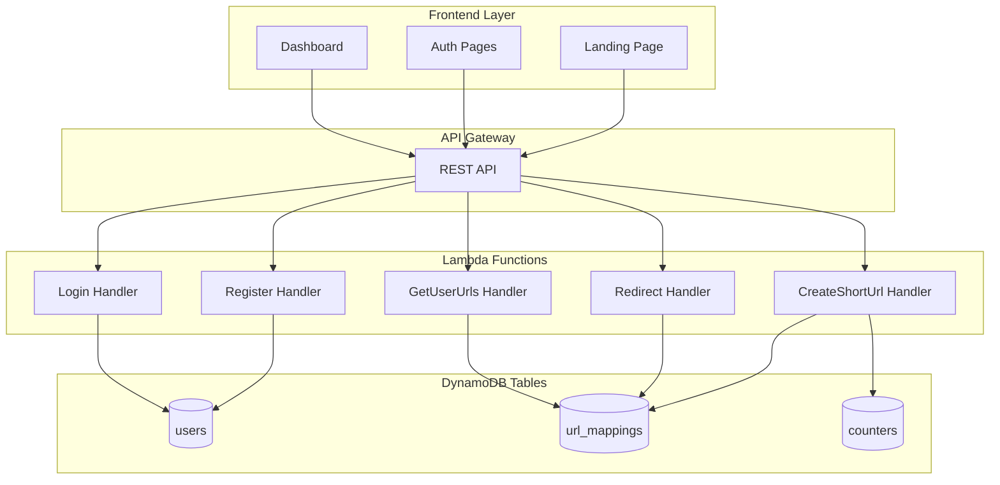
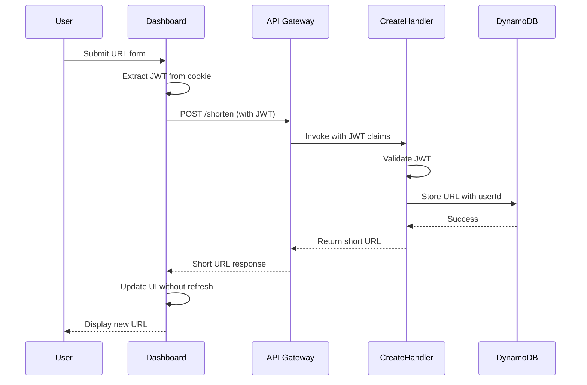
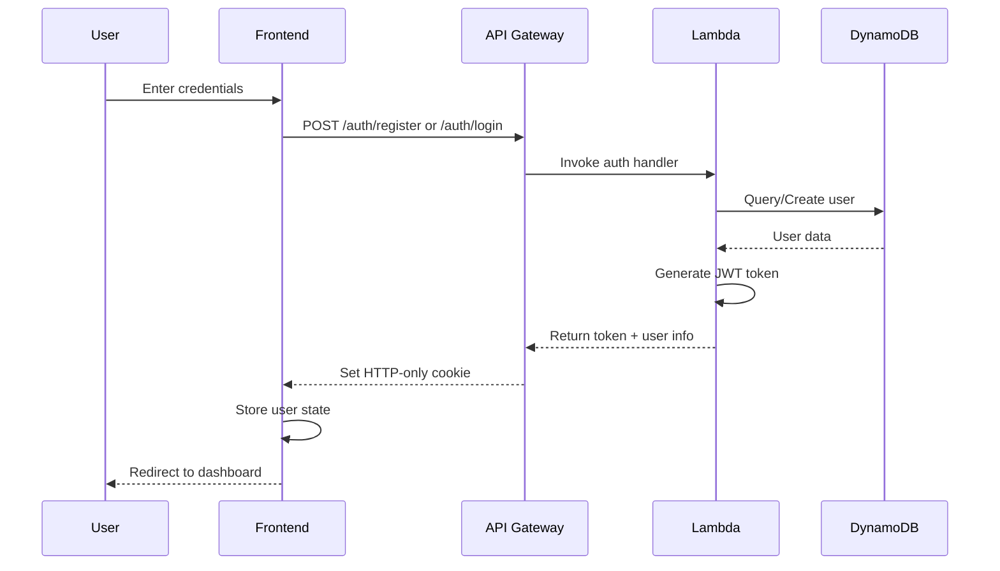
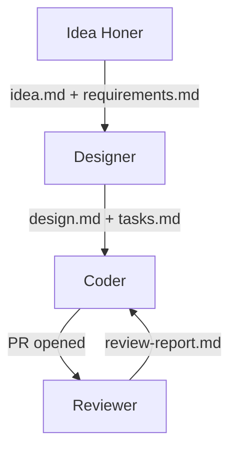

# CloudCut

**Serverless URL shortening and real-time attribution analytics platform built on AWS.**

Designed from the ground up to handle 1 billion shortened URLs and 100 million daily active users — with every architectural decision tied to a specific constraint.

[](https://aws.amazon.com)
[](https://nodejs.org)
[](https://react.dev)
[](LICENSE)

---

## Architecture



---

## Key Flows

### URL Creation (Authenticated)



### Authentication Flow



---

## Key Design Decisions

### Globally Unique Short Codes — Atomic Counter + Base62

The naive approach is hashing. I ruled it out because collision probability grows non-negligible at scale and retry logic adds latency you cannot afford.

Instead I use an atomic counter in DynamoDB. A single `UpdateItem` with `ADD` atomically increments the counter and returns the new value. Two concurrent requests will never receive the same counter value because DynamoDB processes the increment and read as one indivisible operation.

I encode the counter output in Base62 rather than Base64 specifically because the `/` and `+` characters in Base64 break URL routing. At one billion URLs the encoded value is still only 6 characters.

```javascript
// Single atomic increment — zero collision risk, no retries needed
const result = await dynamodb.update({
  TableName: COUNTER_TABLE,
  Key: { counterName: 'url_counter' },
  UpdateExpression: 'ADD #val :inc',
  ExpressionAttributeNames: { '#val': 'value' },
  ExpressionAttributeValues: { ':inc': 1 },
  ReturnValues: 'UPDATED_NEW'
});

const shortCode = base62Encode(result.Attributes.value);
```

### Scale — Lambda + DynamoDB

DynamoDB handles 1 billion records without schema changes and scales horizontally by design. Lambda is fully serverless and scales automatically with traffic spikes without managing any infrastructure.

### User Authentication — JWT + HTTP-only Cookies

Sessions are managed via JWT tokens with 24-hour expiration stored in HTTP-only secure cookies to prevent XSS attacks. Passwords are hashed with bcrypt at cost factor 10. Login errors return the same message for both non-existent email and wrong password to prevent email enumeration.

### Security — IAM Least-Privilege

Every service boundary has IAM roles scoped to the minimum required permissions. Lambda functions cannot access DynamoDB tables they do not own. API Gateway enforces access boundaries before requests reach compute.

### Observability — CloudWatch on Every Invocation

Every Lambda invocation is instrumented with CloudWatch. Every redirect, every shortening operation, every analytics event is logged with structured context including request ID, operation type, and outcome.

### Real-Time Analytics Pipeline

Every click captures: timestamp, referrer source, geographic region derived from IP (raw IP never stored), and user agent. This gives every shortened URL full attribution tracking without storing personally identifiable data.

---

## Non-Functional Targets

| Target | Mechanism |
|--------|-----------|
| 1B shortened URLs | DynamoDB on-demand, no schema changes needed |
| 100M DAU | Lambda serverless auto-scaling |
| Sub-100ms p99 redirect latency | Architecture ready — ElastiCache next step |
| 99.99% availability | Multi-region replication ready — single region currently |

The system currently runs in `us-east-1` as a single region since I am the only user. Every tradeoff was deliberate and explainable.

---

## Data Models

### users Table

| Attribute | Type | Notes |
|-----------|------|-------|
| userId | String (PK) | UUID v4 |
| email | String | RFC 5322 format |
| passwordHash | String | bcrypt cost factor 10 |
| createdAt | Number | Unix timestamp |

GSI: `email-index` — partition key: email. Used for login queries.

### url_mappings Table

| Attribute | Type | Notes |
|-----------|------|-------|
| shortUrl | String (PK) | Base62 encoded counter value |
| longUrl | String | Original URL |
| createdAt | Number | Unix timestamp |
| expiresAt | Number | Optional Unix timestamp |
| userId | String | Optional — owner's userId |
| clickCount | Number | Atomic increment on each redirect |

GSI: `userId-createdAt-index` — partition key: userId, sort key: createdAt. Used for dashboard queries.

### counters Table

| Attribute | Type | Notes |
|-----------|------|-------|
| counterName | String (PK) | e.g. `url_counter` |
| value | Number | Atomically incremented on each URL creation |

---

## Project Structure

```
CloudCut/
├── src/
│   ├── handlers/
│   │   ├── register.js           # POST /auth/register
│   │   ├── login.js              # POST /auth/login
│   │   ├── createShortUrl.js     # POST /shorten — atomic counter + Base62
│   │   ├── redirect.js           # GET /{shortCode} — lookup + 302 + click tracking
│   │   ├── getUserUrls.js        # GET /urls — authenticated user's URLs
│   │   └── analytics.js          # GET /analytics/{shortCode}
│   │
│   └── utils/
│       ├── base62.js             # Encoding: counter value to URL-safe short code
│       ├── counter.js            # DynamoDB atomic increment wrapper
│       ├── jwt.js                # generateToken, verifyToken, extractToken
│       ├── password.js           # hashPassword, comparePassword (bcrypt)
│       └── validation.js         # Email, URL, password validation
│
├── frontend/
│   ├── landing.html              # Marketing landing page
│   ├── register.html             # Registration page
│   ├── login.html                # Login page
│   ├── dashboard.html            # Authenticated URL management dashboard
│   ├── router.js                 # Client-side routing + auth checks
│   ├── auth.js                   # JWT extraction and session management
│   ├── dashboard.js              # URL fetch, create, copy to clipboard
│   └── styles/
│       └── main.css
│
├── infrastructure/
│   ├── deploy-register.bat
│   ├── deploy-login.bat
│   ├── deploy-shorten.bat
│   ├── deploy-redirect.bat
│   ├── deploy-get-user-urls.bat
│   ├── deploy-analytics.bat
│   └── setup-dynamo.bat          # Creates all tables and GSIs
│
├── idea.md                       # Original idea definition
├── requirements.md               # Functional and non-functional requirements in EARS notation
├── design.md                     # Full architecture, correctness properties, testing strategy
├── tasks.md                      # Sequenced implementation tasks mapped to requirements
└── README.md
```
```
~/.kiro/                          ← Global Kiro directory
├── steering/                     ← Auto-loaded in every session everywhere
│   ├── rules.md                  ← Non-negotiable rules
│   ├── mistakes.md               ← Self-improving rules — every mistake logged
│   ├── code-conventions.md       ← Naming, structure, async patterns, test
│   └── structure.md              ← Project layout and agent output file
│
├── agents/                       ← Available from any directory
│   ├── idea-honer.json           ← Adaptive interview → idea.md + requirements.md
│   ├── designer.json             ← requirements.md → design.md + tasks.md
│   ├── coder.json                ← tasks.md → implementation + git 
│   └── reviewer.json             ← All docs → review-report.md + PR reviews
│
└── skills/                       ← Reusable instruction packages referenced
by agents
    ├── idea-interview/           ← Interview framework — topics, question strategy,
    │   └── SKILL.md              ← output format for idea.md and requirements.md
    │                                 
    ├── design-doc/               ← Design doc format — architecture, correctness
    │   └── SKILL.md              ← properties, dual testing strategy, migration path
    │                                 
    ├── task-gen/                 ← Task breakdown rules — max 3 tasks, property test
    │   └── SKILL.md              ← subtasks, requirements traceability
    │                                
    ├── github-pr/                ← PR creation and review workflow
    │   └── SKILL.md                  
    └── test-runner/              ← Test execution and failure protocol
        └── SKILL.md                  
```
---

## How I Built This

CloudCut was built using **Forge** — a self-improving multi-agent development workflow I built on top of Kiro CLI. Each agent has a single responsibility, a clean input, and a clean output. No agent does everything.

### The Pipeline



**Idea Honer** interviewed me with adaptive questions to define the problem, target users, success criteria, and technical constraints. It generated `idea.md` and `requirements.md` in EARS notation with a full Glossary.

**Designer** read `requirements.md` and produced a production-ready `design.md` covering architecture, data models, API contracts, correctness properties, a dual testing strategy with property-based tests, and a phased deployment plan. Then generated `tasks.md` with sequenced implementation tasks each mapped to specific requirements.

**Coder** executed each task in `tasks.md` sequentially, running tests after every task before moving to the next. Opened a PR when all tasks were complete.

**Reviewer** read all generated docs as context and reviewed the implementation end to end against requirements.md and design.md. Checked for edge cases, error handling gaps, security vulnerabilities, and deviations from the design. Wrote findings to `review-report.md` with BLOCKER/MAJOR/MINOR severity levels.

### Self-Improving Rules

Every agent reads a shared `mistakes.md` file before starting any session. Every time an agent did something wrong during development I logged it with one command:

```powershell
mistake "DO NOT use API keys directly in code" CRITICAL
mistake "Always handle DynamoDB conditional write failures with retry" HIGH
mistake "Never store raw IP addresses — derive region and discard" HIGH
```

The mistake becomes a rule instantly. Every subsequent agent session across every project benefits from it. The system compounds over time — the same mistake never happens twice.

This is the same pattern Boris Cherny (creator of Claude Code) uses with CLAUDE.md: *"Anytime we see Claude do something incorrectly we add it to the file so Claude knows not to do it next time. Every mistake becomes a rule."*

---

## API Reference

### Authentication

```
POST /auth/register
{ "email": "user@example.com", "password": "securepassword123" }
→ 201  { "userId": "uuid", "email": "...", "token": "jwt" }
→ 409  { "error": "EMAIL_EXISTS", "message": "Email already registered" }

POST /auth/login
{ "email": "user@example.com", "password": "securepassword123" }
→ 200  { "userId": "uuid", "email": "...", "token": "jwt" }
→ 401  { "error": "INVALID_CREDENTIALS", "message": "Invalid credentials" }
```

### URL Management

```
POST /shorten
Authorization: Bearer <jwt>
{ "longUrl": "https://example.com/...", "customAlias": "my-link", "expiresAt": 1735689600 }
→ 201  { "shortUrl": "https://your-domain/abc123", "shortCode": "abc123" }
→ 401  { "error": "AUTH_REQUIRED", "message": "Authentication required" }

GET /urls
Authorization: Bearer <jwt>
→ 200  { "urls": [{ "shortUrl": "...", "longUrl": "...", "clickCount": 42, ... }] }

GET /{shortCode}
→ 302  Location: https://example.com/...
→ 410  Gone (expired)
→ 404  Not Found
```

### Analytics

```
GET /analytics/{shortCode}
→ 200
{
  "shortCode": "abc123",
  "longUrl": "https://example.com/...",
  "clickCount": 42,
  "createdAt": 1704067200,
  "clicks": [
    {
      "timestamp": 1704153600,
      "referrer": "https://twitter.com",
      "region": "us-east",
      "userAgent": "Mozilla/5.0..."
    }
  ]
}
```

---

## Local Setup

### Prerequisites

- Node.js 18+
- AWS CLI configured with appropriate permissions
- AWS account (free tier sufficient)
---

## Architectural Tradeoffs

| Decision | Chosen | Rejected | Reason |
|----------|--------|----------|--------|
| ID generation | Atomic counter + Base62 | Hash function | Hashing has collision risk at scale, requires retry logic |
| Encoding | Base62 | Base64 | `/` and `+` in Base64 break URL routing |
| Compute | Lambda | EC2 / ECS | Serverless scales to 100M DAU automatically without infrastructure management |
| Storage | DynamoDB | PostgreSQL | Pure key-value access pattern, horizontal scaling by design |
| Auth | JWT + HTTP-only cookies | Sessions | Stateless — no session storage required, enables horizontal scaling |
| Caching | Not yet | ElastiCache | Scoped out for AWS free tier — architecture is ready to add |
| Regions | us-east-1 | Multi-region | Single user currently — multi-region is the next step for 99.99% availability |

---

## What I Would Add Next

- **ElastiCache layer** — Redis caching on the redirect path to hit sub-100ms p99 latency targets at scale
- **Multi-region deployment** — Route 53 health-check failover to reach 99.99% availability
- **QR code generation** — Per-link QR codes for offline sharing
- **Custom domain support** — Bring your own domain for branded short links
- **Link expiry notifications** — Email alerts before links expire

---

## AWS Free Tier Compliance

| Service | Free Tier Limit | Estimated Usage |
|---------|----------------|-----------------|
| Lambda | 1M requests/month | ~50K requests/month |
| DynamoDB | 25 GB storage, 25 RCU/WCU | Well within limits at low traffic |
| API Gateway | 1M calls/month (first 12 months) | ~50K calls/month |
| CloudWatch | 10 custom metrics, 5 GB logs | Within limits |

---

## License

MIT
